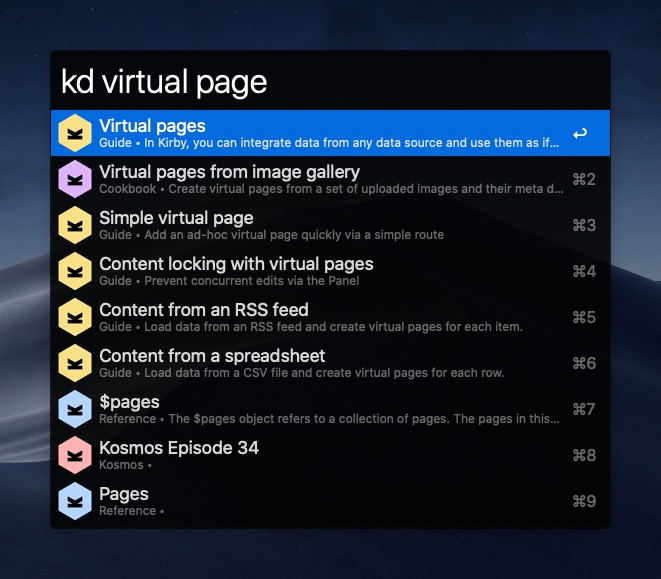

# Kirby Docs search workflow for Alfred 5

An ultra-fast Kirby Docs search workflow for Alfred 5

## ⚠️ You need to have PHP installed!

You need PHP 8+ to run this workflow. The absolutely easiest way is to [download MAMP](https://www.mamp.info/en/downloads/). The next easiest, and much better for your hard drive is to install [PHP](https://formulae.brew.sh/formula/php) via [Homebrew](https://brew.sh). Once you install the PHP, note down the path to its binaries, and install the workflow.

- Homebrew: `/opt/homebrew/bin`
- MAMP: `/Applications/MAMP/bin/php/php8.0.8/bin`

## Installation

1. [Download the latest version](https://github.com/adamkiss/alfred-kirby-search/releases)
2. Install the workflow by double-clicking the `.alfredworkflow` file
3. During the import, there are two configurable fields:
	- **PHP Usage script** - Here's where you can add shell code to locate your PHP binary. e.g.: `export PATH=/opt/homebrew/bin:$PATH`
	- **Use Adam's shortcuts** - There's a number of pages that are missing from Kirby's Algolia Index
4. You can use the search now :)

## Usage

- Open Alfred prompt
- `kd <query>` - Search the Kirby docs
- `kd <A> <query>` - if your query is preceded by a single letter - one of `[cgkpr]` - followed by a space, the query search will be limited to the area this letter refers to:
	- <kbd>c</kbd> - Cookbook
	- <kbd>g</kbd> - Guide
	- <kbd>k</kbd> - Kosmos
	- <kbd>p</kbd> - Plugins
	- <kbd>r</kbd> - Reference

## Acknowledgments

- Matt Clinton and their [Alfred Tailwind Docs search](https://github.com/clnt/alfred-tailwindcss-docs), which I used as a reference
- Bastian Allgeier for allowing me to piggyback on the Algolia search index already available on [getkirby.com](https://getkirby.com)

## Copyright / License

(c) 2021-2022 Adam Kiss, licensed under [MIT License](https://github.com/adamkiss/alfred-kirby-search/blob/main/LICENSE).

